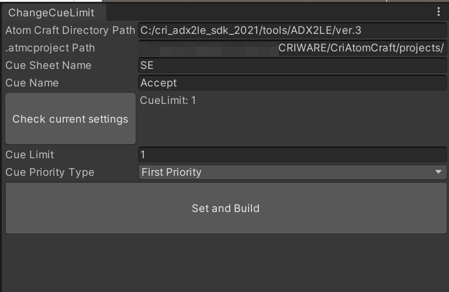

# ADX2forUnityChangeCueSettings
ADX2 for Unityプラグインにおいてキューの設定を上書きするエディタ拡張

## 動作確認
- Unity 2020.3.4f1
- ADX2 LE Tools 3.44.20
- Python3.8

ADX2の「ロボット機能」を使用するため、セットアップが必要です。
https://game.criware.jp/learn/tutorial/atomcraft/atomcraft_robot_01/

## 現在できること
- 再生数上限（キューリミット）の変更
- 先着優先・後着優先の変更

## 操作方法
- Window -> CRIWARE -> ChangeCueLimitWindowでウィンドウを開く
- CriAtomCraftC.exeのあるディレクトリパス、Atomプロジェクトのパス、ワークユニット、キューシートフォルダ、キューシート、キューを入力
- Check current settingsで現在のキューの設定を取得
- Cue Limit, Cue Priority Typeに変更したい値を入力
- Set and Buildで実行
- ビルド完了後、Atom Browserのimport Assetsボタンでビルド後のファイルを上書き取得

## ADX2製品版で利用する場合
Assets\Editor\CriWareExtension\ADX2PythonScriptsBase\ChangeCueLimit_ADX2PythonScriptBase.txtの
「ターゲットコンフィグの取得」処理をPublicから任意のターゲット名（Smartphoneなど）に変更することで利用できます。
